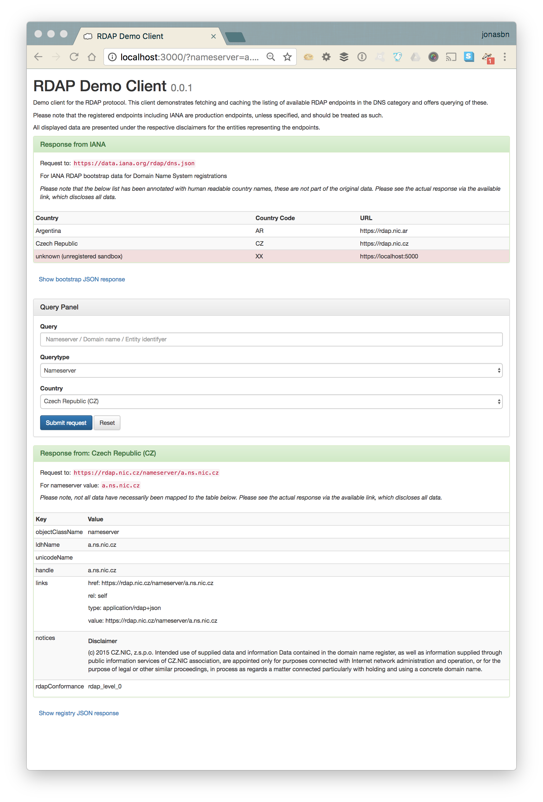

# NAME

DK Hostmaster RDAP demo client

# VERSION

This documentation describes version 0.0.1

# INTRODUCTION

This client demonstrates fetching and caching the listing of available RDAP endpoints in the DNS category and offers querying of these.

Please note that the registered endpoints including IANA are production endpoints, unless specified, and should be treated as such. 

All displayed data are presented under the respective disclaimers for the entities representing the endpoints.

## Caching

The client creates a directory in the application root folder called cache. The cache can be emptied/flushed by deleting the appropirate data in the cache, facilities to this via the client mighe be added in the future.

## Parameter Validation

The client aims to be able to emulate different scenarios, such as sending no data, sending bad data, requesting non-existing objects etc. so no valid is performed on input data.

# USAGE

    $ morbo -l https://*:3000 client.pl

Open your browser at:

    https://127.0.0.1:3000/

## Using `carton`

    $ carton

    $ carton exec -- morbo -l https://*:3000 client.pl

Open your browser at:

    https://127.0.0.1:3000/

# DEPENDENCIES

This client is implemented using Mojolicious::Lite in addition the following
Perl modules are used all available from CPAN. The exact list in available in the [`cpanfile`](cpanfile).

- [Mojolicious::Lite](https://metacpan.org/pod/Mojolicious::Lite)
- [Mojo::UserAgent](https://metacpan.org/pod/Mojo::UserAgent)
- [CHI](https://metacpan.org/pod/CHI)
- [Cwd](https://metacpan.org/pod/Cwd)
- [Readonly](https://metacpan.org/pod/Readonly)
- [Mojo::JSON](https://metacpan.org/pod/Mojo::JSON)
- [HTTP::Date](https://metacpan.org/pod/HTTP::Date)
- [Data::Dumper](https://metacpan.org/pod/Data::Dumper)
- [Locale::Codes::Country](https://metacpan.org/pod/distribution/Locale-Codes/lib/Locale/Country.pm)

In addition to the above Perl modules, the client uses [Twitter Bootstrap](http://getbootstrap.com/) and hereby **jQuery**. These are automatically downloaded via CDNs and are not distributed with the client software. In addition [Prism](http://prismjs.com/index.html) is use and is included with the client as an asset.

# SEE ALSO

- [Protocol Registries with IANA](https://www.iana.org/protocols)
- [Using RDAP as a Domain Availability Service](https://www.ietf.org/id/draft-newton-regext-rdap-domain-availability-00.txt)
- [RFC:7480: HTTP Usage in the Registration Data Access Protocol (RDAP)](https://tools.ietf.org/html/rfc7480)
- [RFC:7482: Registration Data Access Protocol (RDAP) Query Format](https://tools.ietf.org/html/rfc7482)
- [RFC:7483: JSON Responses for the Registration Data Access Protocol (RDAP)](https://tools.ietf.org/html/rfc7483)
- [RFC:7484: Finding the Authoritative Registration Data (RDAP) Service](https://tools.ietf.org/html/rfc7484)
- [RFC:5890: Internationalized Domain Names for Applications (IDNA): Definitions and Document Framework](https://tools.ietf.org/html/rfc5890)

# COPYRIGHT

This software is under copyright by DK Hostmaster A/S 2017

# LICENSE

This software is licensed under the MIT software license

Please refer to the [LICENSE file](LICENSE) accompanying this file.
